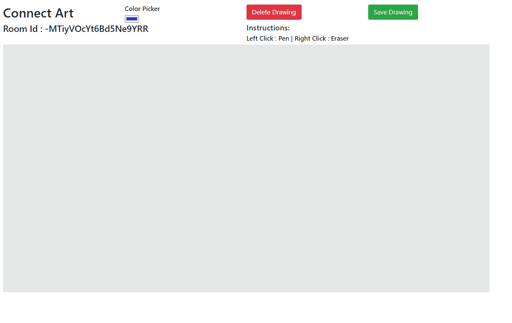
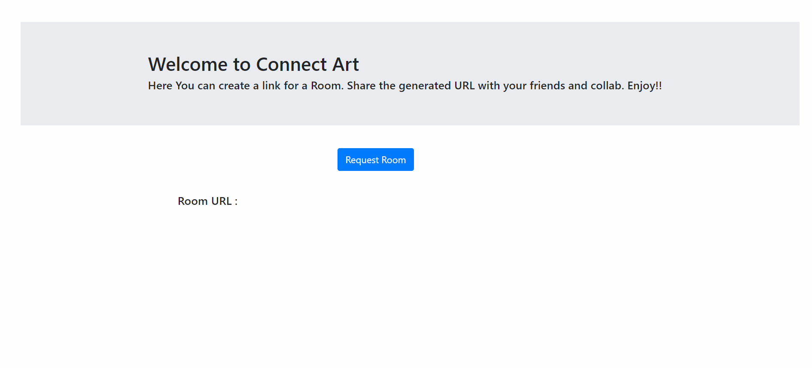

# Connect Art
 ### A web application to make collaborative artworks.
 
 

## Features

### Private Rooms
    Home Page offers to create private rooms which can then be shared with people via generated links

### Saving the Artwork
    A still of Canvas can be saved via 'Save Drawing Button'

### Brush Features
    - Application offers a color Picker for the brush.
    - Brush can act as a pen and eraser.

## Libraries Used

### Express
    For Server

### HandleBarjs
    For server side templating
 
### Firebase
    For RealTime Database

### P5js
    For Canvas

### Bootstrap and jQuery
    For UI
